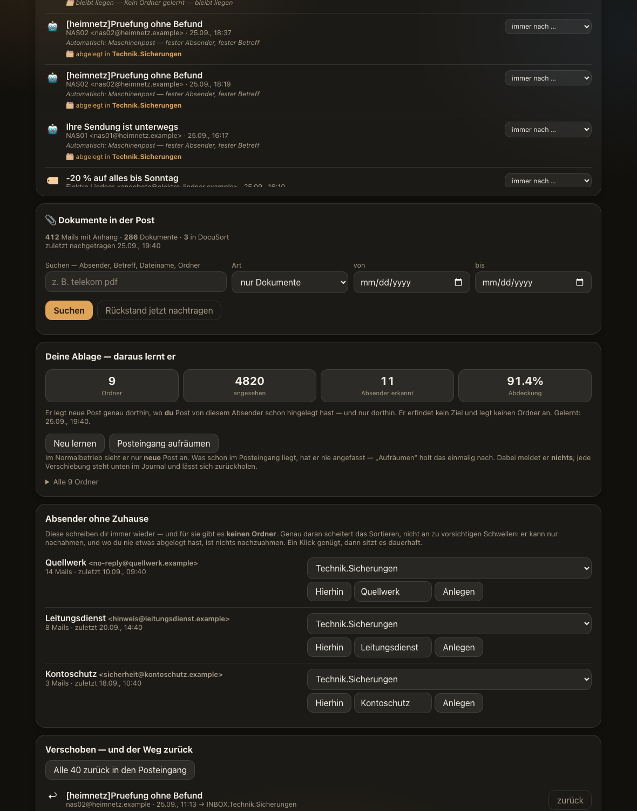
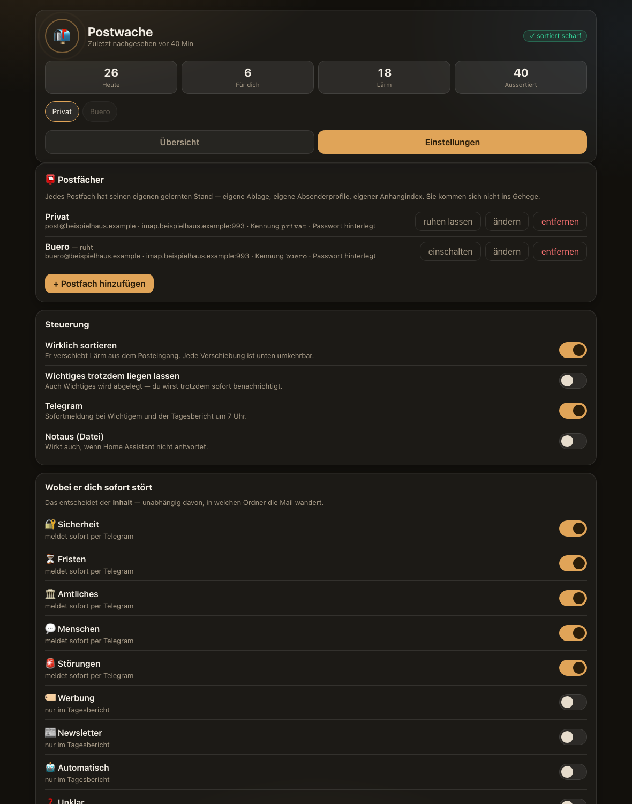
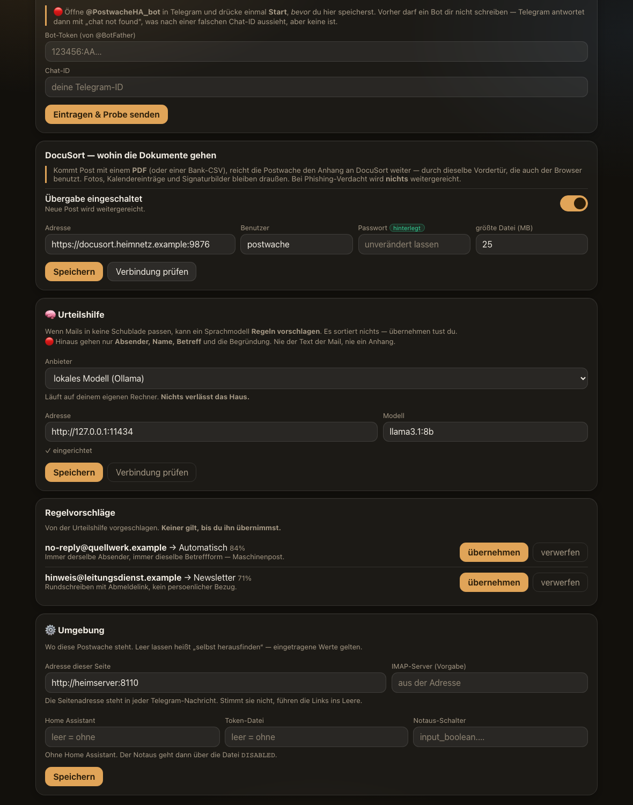

<h1 align="center">Postwache</h1>

<p align="center">
  <b>A watchman for your mailbox.</b><br>
  It sorts the noise <i>out</i>. What matters stays where you already look.
</p>

<p align="center">
  
  
  
  
</p>


---

## The one idea

Most mail tools ask *"where does this belong?"* and file everything. The
Postwache asks the opposite question:

> **What in here is just noise?**

Newsletters, adverts, delivery notices, backup reports — out of the inbox. A
bill, a letter from the authorities, a security warning, a message from a real
person — **left exactly where you already look for it.**

🔴 A sorter that tidies away something important is more dangerous than no
sorter at all. That single sentence shapes every decision in this program.

## It learns from you, not from a model

The Postwache never invents a folder. It reads how **you** have been filing mail
for years and copies you: if three mails from your energy supplier ended up in
`Invoices`, that is where the next one goes. Where you never filed anything, it
leaves the mail alone and says so.

That is also why it costs nothing to run: **there is no language model in the
loop.** The watchman is plain Python, it looks at the new mail once a minute,
and a quiet run takes 0.2 seconds.

## What it does

| | |
|---|---|
| 📥 **Several mailboxes** | Each with its own learned filing, its own sender profiles, its own attachment index. They never mix. |
| 🔇 **Sorts the noise out** | Only into folders you already use. It never creates one. |
| 🔔 **Tells you what matters** | Deadlines, authorities and banks, security warnings, real people — immediately, by Telegram. |
| 📎 **Finds documents** | Every attachment is indexed **without downloading it** (IMAP `BODYSTRUCTURE`). Search years back: *"every mail with a PDF from my insurer"*. |
| 🗂 **Hands papers on** | PDFs can go straight to [DocuSort](https://github.com/robeertm/DocuSort) — see below. |
| 🧠 **Optional judgment helper** | When mail fits no drawer, a language model can **propose a rule**. Local (Ollama) or a service. Off by default. |
| ↩️ **Everything is reversible** | Every move is journalled. One click puts a mail back; one click puts them all back. |
| 🛑 **Two emergency stops** | A file on disk, and a switch in Home Assistant. Either one alone stops it. |

## What it will not do

- **It never deletes.** There is no call in this program that deletes a mail or
  sets the `\Deleted` flag. Not one.
- **It never marks mail as read.** Every fetch uses `BODY.PEEK`. In learning
  mode the mailbox is opened read-only, so even a programming mistake cannot
  change anything.
- **It never arms itself.** Until you say so, it only writes down what it
  *would* do.



## Install

### One command

```bash
curl -fsSL https://raw.githubusercontent.com/robeertm/Postwache/main/deploy/install.sh | sh
```

Writes a `docker-compose.yml`, pulls the image, starts it on port 8110.

### Docker Compose by hand

```yaml
services:
  postwache:
    image: ghcr.io/robeertm/postwache:latest
    container_name: postwache
    restart: unless-stopped
    ports:
      - "8110:8110"
    environment:
      - TZ=Europe/Berlin
      - POSTWACHE_TAKT=60     # seconds between runs; a container has no cron
    volumes:
      - ./data:/data          # credentials, what it learned, the log
```

```bash
mkdir -p data && docker compose up -d
```

### From source

No third-party packages — the standard library is enough.

```bash
git clone https://github.com/robeertm/Postwache.git && cd Postwache
POSTWACHE_HOME=~/.postwache python3 post_web.py     # the page on :8110
```

Run the watchman from cron, once a minute:

```
* * * * * POSTWACHE_HOME=$HOME/.postwache /usr/bin/python3 /path/to/postwache.py >/dev/null 2>&1
```

### Try it without a mailbox

```bash
python3 demo/demo_daten.py /tmp/postwache-demo
POSTWACHE_HOME=/tmp/postwache-demo python3 post_web.py
```

Invented data, a filled page, nothing connected. The screenshots on this page
come from exactly that.

## First run

1. Open `http://<host>:8110` → **Einstellungen** → add a mailbox (IMAP address,
   password, server). The connection is tested immediately.
2. Leave it in **learning mode**. It reads the last 300 mails to learn where
   things belong, moves nothing, and tells nobody.
3. Look at what it *would* do. When that looks right, arm it.



## The judgment helper (optional)

When mail fits into no drawer, the watchman can ask a language model for a
**rule** — never for a decision about a single mail, and it never applies the
rule itself. You see the proposal and take it or leave it.

| Provider | What leaves your machine |
|---|---|
| **off** (default) | nothing — unclear mail simply waits on the page |
| **Ollama** | nothing — the model runs on your own hardware |
| OpenAI / Anthropic | sender, name, subject, and why it was unclear |
| your own agent | the same, written into a folder you name |

🔴 **Never the body of a mail, never an attachment.** Whatever you pick.



## Works with DocuSort

<table>
<tr><td width="62%">

[**DocuSort**](https://github.com/robeertm/DocuSort) is the other half of the
same idea: it files the *documents* — invoices, statements, contracts — reads
the amounts, and matches them against your bank bookings.

The Postwache hands it the paper. When mail arrives with a PDF, the attachment
goes straight into DocuSort through the same front door a browser uses
(`POST /upload`, with its own service account you can switch off at any time).
Photos, calendar invitations and signature images stay out. Anything that looks
like phishing is never handed on.

You can also search **backwards**: *"every mail with a PDF from the tax office"*,
select them, and send the lot over in one go. Already-handed-over documents are
marked, so you never send the same paper twice.

</td><td>

**Together**

```
  mailbox
     │
     ▼
 Postwache   ← noise out,
     │         documents found
     ▼
 DocuSort    ← filed, amount read,
     │         booking matched
     ▼
  answered
```

</td></tr>
</table>

## Privacy

- Credentials live in `0600` files inside your data directory. They are never
  printed, never logged, never sent to the browser — the page only ever learns
  *whether* a password is set.
- The page has **no account and no login**. Put it behind your own reverse
  proxy or a private network (Tailscale, WireGuard). It is built to be reachable
  only by you.
- Nothing is sent anywhere unless you configure it: Telegram, DocuSort and the
  judgment helper are each off until you turn them on.

## Updating

**Docker never re-pulls a running container.** `:latest` is a label, not a
subscription:

```bash
docker compose pull && docker compose up -d
```

`docker-compose.yml` ships a commented **Watchtower** block if you want it done
for you (nightly at 04:00). It needs the Docker socket, which is effectively
root on the host — that is the price, stated plainly.

## Honest limitations

- **The interface is German only.** The code and its comments are German too.
  That is where this program grew up; translating it is not done.
- **No user accounts.** One page, one household. See *Privacy* above.
- **IMAP only.** No Exchange, no Gmail API — an IMAP account of any provider.
- It was built for one household and now runs in more than one. Bugs you find
  are bugs nobody has seen yet.

## Licence

Source-available, not open source. You may read it, run it privately, and study
it; you may not sell it or ship it as your own. See [LICENSE](LICENSE).
